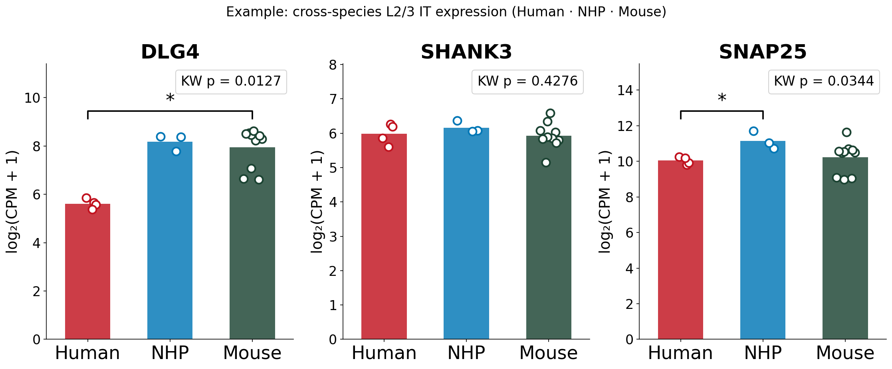
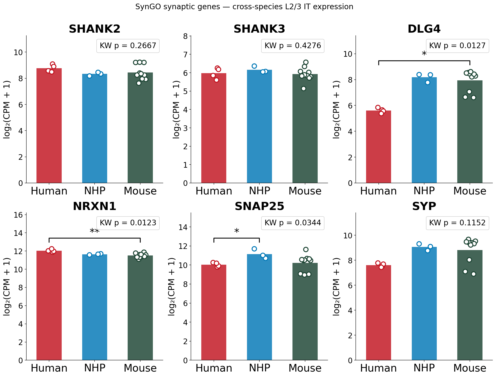
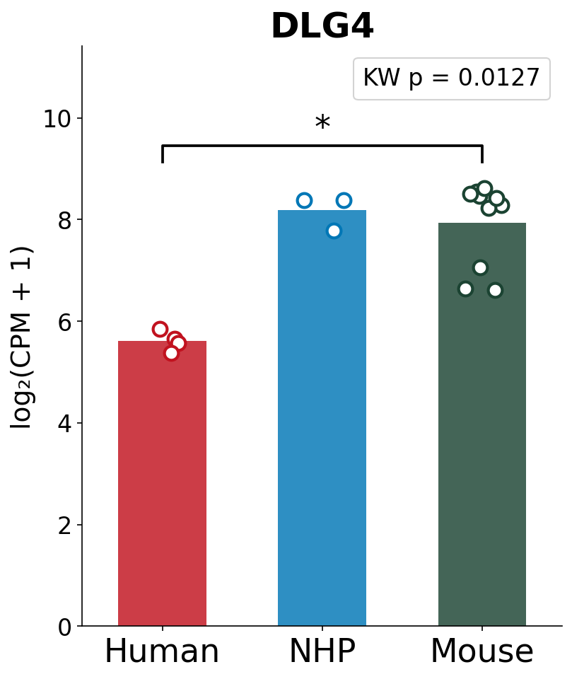

# CrossGeneEx

**Cross-species L2/3 IT gene expression explorer** — an interactive GUI tool for visualising and comparing gene expression across Human, Rhesus macaque (NHP), and Mouse layer 2/3 intratelencephalic (IT) neurons from single-nucleus RNA-seq data.

---

## Example output

### Three-gene comparison (DLG4 · SHANK3 · SNAP25)


Bars show species mean log₂(CPM + 1); open circles are individual donors (Human n=4, NHP n=3, Mouse n=10). The legend box shows the Kruskal-Wallis p-value. Significance brackets (Dunn post-hoc, Bonferroni-corrected) appear only when KW p < 0.05.

### SynGO synaptic gene panel


---

## Features

- **Gene name search** — type any HGNC symbol to filter and select from 14,617 ortholog-validated genes
- **SynGO term browser** — navigate the full SynGO hierarchy (synapse → presynapse → presynaptic active zone → …); selecting a parent term automatically includes all descendant genes
- **Bar plots with donor overlay** — species mean bars with individual donor dots and jitter
- **Statistical annotations** — Kruskal-Wallis p-value shown as a legend; Dunn post-hoc brackets (★ p < 0.05 / ★★ p < 0.01 / ★★★ p < 0.001) drawn automatically when significant
- **Summary table** — gene × species means, KW p-value, and significant post-hoc pairs (e.g. `NHP>Human (p=0.013)`)
- **Download** — per-plot PNG and table CSV via save dialog

---

## Installation

```bash
git clone https://github.com/ylemnox/CrossGeneEx.git
cd CrossGeneEx
pip install -r requirements.txt
```

> **Python ≥ 3.10** required.

---

## Usage

### Desktop GUI (PyQt6)

```bash
python app_gui.py
```



**Left panel — gene selection**

| Tab | What to do |
|-----|-----------|
| Search by Gene Name | Type a symbol in the search box → check genes → click **▶ Generate Plots** |
| Browse by SynGO Term | Expand the hierarchy tree → select a term → genes load automatically → adjust checkboxes → click **▶ Generate Plots** |

**Right panel** — plots appear in a 3-column scrollable grid. Click **⬇ Download [GENE].png** to save any plot. Use **⬇ Download Table (CSV)** for the summary table.

---

### Streamlit web app (alternative)

```bash
streamlit run app.py
```

---

## Data

All required files are bundled in the `data/` directory:

| File | Description |
|------|-------------|
| `AllGenes_L23IT_10xOnly_species_comparison_strict_log2cpm.csv.gz` | 14,617 genes × 17 donors — log₂(CPM + 1) pseudobulk expression |
| `AllGenes_L23IT_10xOnly_species_comparison_strict_sample_metadata.csv` | Donor–species mapping (4 Human · 3 NHP · 10 Mouse) |
| `AllGenes_L23IT_10xOnly_kruskal_results.csv` | Kruskal-Wallis statistic, p-value, and BH-FDR for all 14,617 genes |
| `AllGenes_L23IT_10xOnly_kruskal_significant.csv` | Dunn post-hoc p-values (Bonferroni) for KW-significant genes |
| `AllGenes_L23IT_syngo_annotations.csv` | Gene → SynGO term mapping for 1,477 synaptic genes |
| `go-basic.obo` | Gene Ontology OBO file used to build the SynGO term hierarchy |

---

## Statistical methods

- **Pseudobulk**: raw counts summed per donor across all L2/3 IT cells, normalised to CPM, log₂(CPM + 1) transformed
- **Kruskal-Wallis test**: non-parametric 3-group comparison using donors as samples (n = 17)
- **Dunn post-hoc**: Bonferroni-corrected pairwise comparisons, run only for genes with KW nominal p < 0.05
- **SynGO hierarchy**: parent–child relationships derived from GO `is_a` and `part_of` edges in `go-basic.obo`

---

## Data sources

- **Human & NHP** — Jorstad NL et al. (2023). Transcriptomic cytoarchitecture reveals principles of human neocortex organization. *Science*, 382, eadf6812. Data: [NeMO Archive](https://data.nemoarchive.org/publication_release/Great_Ape_MTG_Analysis/)
- **Mouse** — Yao Z et al. (2023). A high-resolution transcriptomic and spatial atlas of cell types in the whole mouse brain. *Nature*, 624, 317–332. Data: [Allen Brain Cell Atlas](https://portal.brain-map.org/atlases-and-data/bkp/abc-atlas)
- **Orthologs** — Cunningham F et al. (2022). Ensembl 2022. *Nucleic Acids Research*, 50, D988–D995
- **SynGO** — Koopmans F et al. (2019). SynGO: An Evidence-Based, Expert-Curated Knowledge Base for the Synapse. *Neuron*, 103, 217–234

---

## Requirements

```
streamlit>=1.32
PyQt6
pandas
numpy
matplotlib
goatools
```
